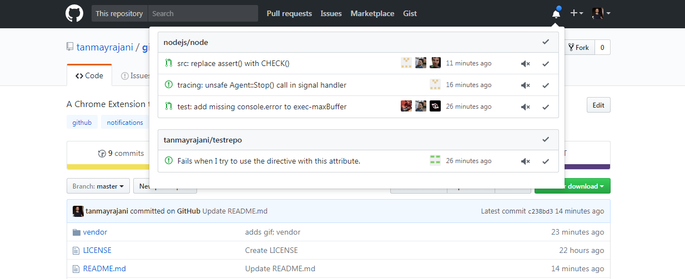

## Notifications Preview for GitHub (same page pop-overs) | Chrome Extension 

#### Install:
- Install it from [Chrome Webstore](https://chrome.google.com/webstore/detail/github-notifications-prev/kgilejfahkjidpaclkepbdoeioeohfmj?hl=en&gl=IN)

#### Things it offers:
- Allows to preview the unread notifications using pop-overs looking exactly like the ones on the right (profile and new-repo)
- Allows to perform actions like marking as read and unsubscribing on the notifications 

#### Few things to know:
- I'm new to making open-source contributions so feel free to suggest me how to do things better :)

#### Screenshot: 
  
--------------------------
> License: MIT
