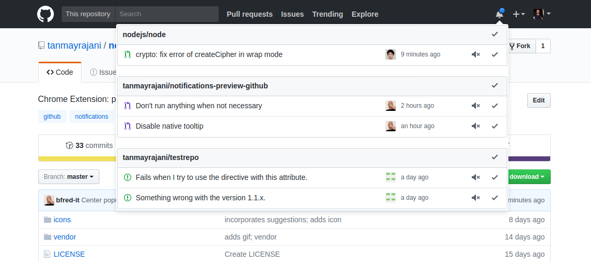

# Notifications Preview for GitHub  
> Browser extension - Quickly see your notifications in a popup without leaving the current page

## Install

- [**Chrome** extension](https://chrome.google.com/webstore/detail/notifications-preview-for/kgilejfahkjidpaclkepbdoeioeohfmj)
- [**Firefox** add-on](https://addons.mozilla.org/en-US/firefox/addon/notifications-preview-github/)
- Opera - Use [this Opera extension](https://addons.opera.com/en/extensions/details/download-chrome-extension-9/) to install the Chrome version.

## Few things to know

I'm new to making open-source contributions so feel free to suggest me how to do things better :)

## Screenshot

## License

MIT
