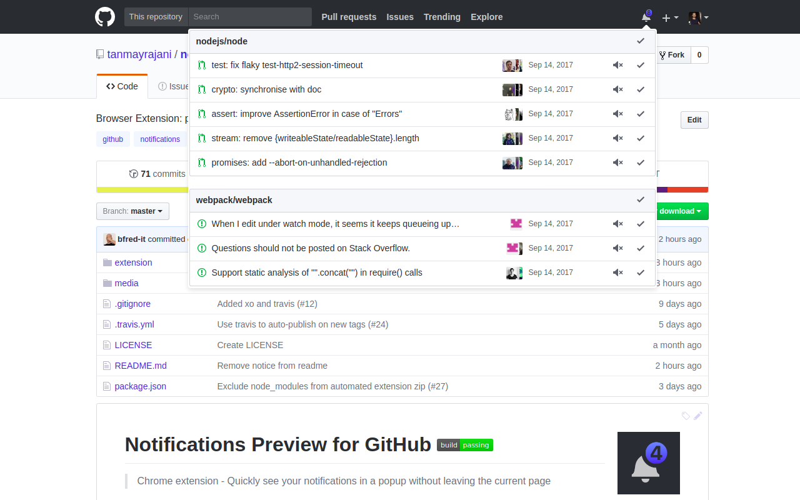

# Notifications Preview for GitHub | Chrome Extension 

- Allows to preview the unread notifications using pop-overs looking exactly like the ones on the right (profile and new-repo)
- Allows to perform actions like marking as read and unsubscribing on the notifications 

## Install

- [**Chrome** extension](https://chrome.google.com/webstore/detail/notifications-preview-for/kgilejfahkjidpaclkepbdoeioeohfmj)
- Opera - Use [this Opera extension](https://addons.opera.com/en/extensions/details/download-chrome-extension-9/) to install the Chrome version.

## Few things to know

I'm new to making open-source contributions so feel free to suggest me how to do things better :)

## Screenshot

## License

MIT
